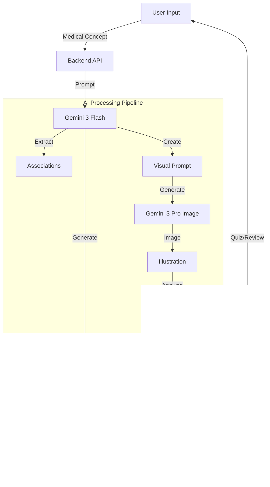

# 🧠 MediMnemonic AI - Medical Visual Learning Assistant

MediMnemonic is an AI-powered platform designed to transform dense medical facts into unforgettable mnemonic stories and custom visual illustrations. It uses Spaced Repetition (SRS) to help medical students and professionals retain high-yield information.

---

## 🚀 Deployment: Pure Serverless on Modal

This application is deployed on **[Modal](https://modal.com)**, utilizing its state-of-the-art AI infrastructure. Following Modal's philosophy, all infrastructure is defined in **pure Python**—no YAML files required.

### **Key Infrastructure Features**
- **Serverless FastAPI**: The backend scales automatically and supports cold starts in seconds.
- **Persistent Storage (Volumes)**: Using `modal.Volume`, the SQLite database is persisted independently of the containers. Even during redeployments, your users and stories remain safe.
- **Automatic Frontend Serving**: The React (Vite) app is built locally and bundled into the Modal image, allowing the entire application to run under a single Modal URL.

---

## 🛠 Deployment & Workflow

### **1. Prerequisites**
- Python 3.10+ and `uv` package manager.
- Node.js & npm (for frontend builds).
- A Modal account (`modal setup`).

### **2. The Deployment Flow**
To update the application, run the following sequence:

```bash
# 1. Build the React Frontend
cd frontend
npm run build
cp -r dist/* ../backend/app/static/

# 2. Deploy to Modal
cd ../backend
uv run modal deploy modal_app.py
```

---

## 📊 Database Management

The database is managed as a Modal Volume named `medmnemonic-data`.

### **Uploading Local Data**
If you have a local `medmnemonic.db` that you want to move to your live production environment:
```bash
cd backend
uv run modal volume put medmnemonic-data medmnemonic.db /medmnemonic.db
```

### **Querying Remote Data**
You can inspect your live database without downloading it by entering the Modal Shell:

1. **Enter the Shell**:
   ```bash
   uv run modal shell modal_app.py
   ```
2. **Run a Quick Python Query**:
   ```bash
   python3 -c "import sqlite3; conn = sqlite3.connect('/data/medmnemonic.db'); print(conn.execute('SELECT username, email FROM users').fetchall())"
   ```

### **Downloading for Inspection**
```bash
uv run modal volume get medmnemonic-data medmnemonic.db remote_backup.db
```

---

## 🔌 API & Querying Data

The application provides a RESTful API. You can "ping" your live instance to fetch information or verify connectivity.

### **Base URL**
`https://sotoblanco263542--medmnemonic-fastapi-app.modal.run`

### **Useful Endpoints**
- **Public**: `GET /` (Serves the Web UI)
- **Auth**: `POST /api/auth/register` | `POST /api/auth/token`
- **Stories**: `GET /api/stories` (Requires JWT Bearer token)

### **Example: Fetching Stories via curl**
```bash
curl -X GET "https://sotoblanco263542--medmnemonic-fastapi-app.modal.run/api/stories" \
     -H "Authorization: Bearer YOUR_JWT_TOKEN"
```

---

## ✨ Implemented Fixes & Features

- ✅ **Multi-User Isolation**: Each user can only see and delete their own stories.
- ✅ **Duplicate Prevention**: The frontend identifies if a story is already saved and prevents redundant database entries.
- ✅ **Graceful Error Handling**: Fixed a server crash (500) during signup when an email already existed; it now returns a clean 400 error.
- ✅ **Robust Deletion**: Resolved an issue where story deletion was intermittent by correctly managing asynchronous database sessions.
- ✅ **No YAML**: The entire deployment stack is managed via `backend/modal_app.py`.

---

## 🔒 Security
- **Secrets**: API keys (like `GEMINI_API_KEY`) are managed via `modal.Secret` and loaded from your local `.env` file during deployment, ensuring they are never committed to version control.
- **Passwords**: Hashed using `bcrypt` before storage.

---

## 📖 Project Overview

**MedMnemonic** is an intelligent educational platform designed to help medical students and professionals master complex medical concepts through the power of **mnemonic storytelling** and **visual learning**. By transforming dry, high-yield medical facts into wacky, memorable stories and vivid illustrations, the application leverages the "memory palace" technique to significantly improve long-term retention.

At its core, MedMnemonic combines the proven efficiency of **Spaced Repetition Systems (SRS)** with generative AI. Users can input a medical topic (e.g., "Macrolide Antibiotics"), and the system instantly generates a narrative where medical terms become characters (e.g., "Macrolide" becomes "Macaroni Slide"), complete with a visual scene. Users can then quiz themselves, review facts, and track their progress over time.

### 🤖 AI Features & Pipeline

The application integrates a suite of advanced AI features powered by Google's **Gemini 3** model family:

1.  **Mnemonic Story Generation**: Converts medical facts into humorous, coherent stories using `gemini-3-flash-preview` with **High Reasoning**.
2.  **Visual Prompt Engineering**: Automatically extracts key visual elements from the story to create detailed image generation prompts.
3.  **AI Illustration generation**: Generates cartoon-style educational illustrations using `gemini-3-pro-image-preview` for high-fidelity text rendering.
4.  **Intelligent Quiz Generation**: Creates challenging, second-order thinking questions based on the generated associations.
5.  **Text-to-Speech (TTS)**: Narrates stories using `gemini-2.5-flash-preview-tts` for auditory learning.
6.  **Visual Grounding (Bounding Boxes)**: Analyzes generated images to locate and highlight specific characters, linking them directly to their medical concepts.



### 🌟 What to Expect with Gemini 3 (Upgrade Details)

We have upgraded the underlying AI models from **Gemini 2.5** to **Gemini 3**. Here is specifically what you will see differently:

| Feature | Previous Model (Gemini 2.5) | **New Model (Gemini 3)** | **Impact on user Experience** |
| :--- | :--- | :--- | :--- |
| **Quiz Logic** | Generated questions based on surface-level associations. Distractors were sometimes obvious. | **Gemini 3 Flash** with `thinking_level="high"` | **Deeper Questions**: The AI now "reasons" through the pathophysiology before asking. Expect questions that test *why* a symptom occurs, not just *that* it occurs. Distractors are now medically plausible "traps". |
| **Mnemonic Quality** | Creative but occasionally nonsensical connections (hallucinations). | **Gemini 3 Flash** with `thinking_level="high"` | **Logical Bridges**: The mnemonic stories now have a stronger logical backbone. The phonetic links (e.g. "Macrolide" -> "Macaroni") are more consistent and less "stretched". |
| **Visuals & Text** | Images were artistic but often failed to render text (e.g. gibberish on pill bottles). | **Gemini 3 Pro Image** (Nano Banana) | **Legible Labels**: You can now expect text inside images to be readable. If a character holds a sign saying "PDA", it will actually say "PDA". |
| **Image Fidelity** | Good general composition but struggled with complex multi-character prompts. | **Gemini 3 Pro Image** | **Precise Instruction Following**: The model adheres much more strictly to the complex visual prompts generated by the story engine, resulting in images that actually match the narrative. |

---

## ⚖️ Strengths & Weaknesses

### ✅ Strengths
-   **Advanced Reasoning**: Uses **Gemini 3** `thinking_level="high"` to generate medically accurate, second-order thinking quiz questions and logical mnemonic associations.
-   **High-Fidelity Text Rendering**: Incorporates `gemini-3-pro-image-preview` to ensure text within generated illustrations (e.g. drug names on bottles) is legible and correct.
-   **Personalized Learning**: Dynamically generates unique content for *any* medical topic, unlike static libraries.
-   **Multi-Modal**: Combines text, audio, and visual learning styles for maximum retention.
-   **Zero-Friction Access**: "Guest Mode" allows immediate usage without registration.
-   **Scientific Foundation**: Built on proven spaced repetition algorithms (SuperMemo-2 based).
-   **Modern Stack**: Fully serverless architecture (Modal + FastAPI + React) ensures high scalability and low maintenance.

### ⚠️ Weaknesses
-   **Guest Persistence**: Guest accounts are session-dependent; clearing browser data results in permanent data loss.
-   **AI Latency**: Generating high-quality images and stories can take several seconds, breaking the flow for impatient users.
-   **Hallucination Risk**: As with all GenAI, mnemonic associations may occasionally be nonsensical or factually stretched.
-   **Mobile Experience**: The complex UI (dashboards, split-screens) is currently optimized for desktop/tablet widths.

---

## 📝 To-Do List

-   [ ] **Account Linking**: Allow "Guest" users to convert to permanent accounts to save their data.
-   [ ] **Mobile Optimization**: Refactor complex views (Learning Path, Library) for better responsiveness on small screens.
-   [ ] **Offline Mode**: Implement PWA capabilities to allow reviewing pre-loaded cards without internet.
-   [ ] **Custom Image Uploads**: Allow users to upload their own mnemonic images if AI generation misses the mark.
-   [ ] **Social Sharing**: Enable sharing of successful mnemonics with other users in a public community library.
-   [ ] **Deep SRS Configuration**: Add settings for users to tweak their spaced repetition intervals and algorithm parameters.
